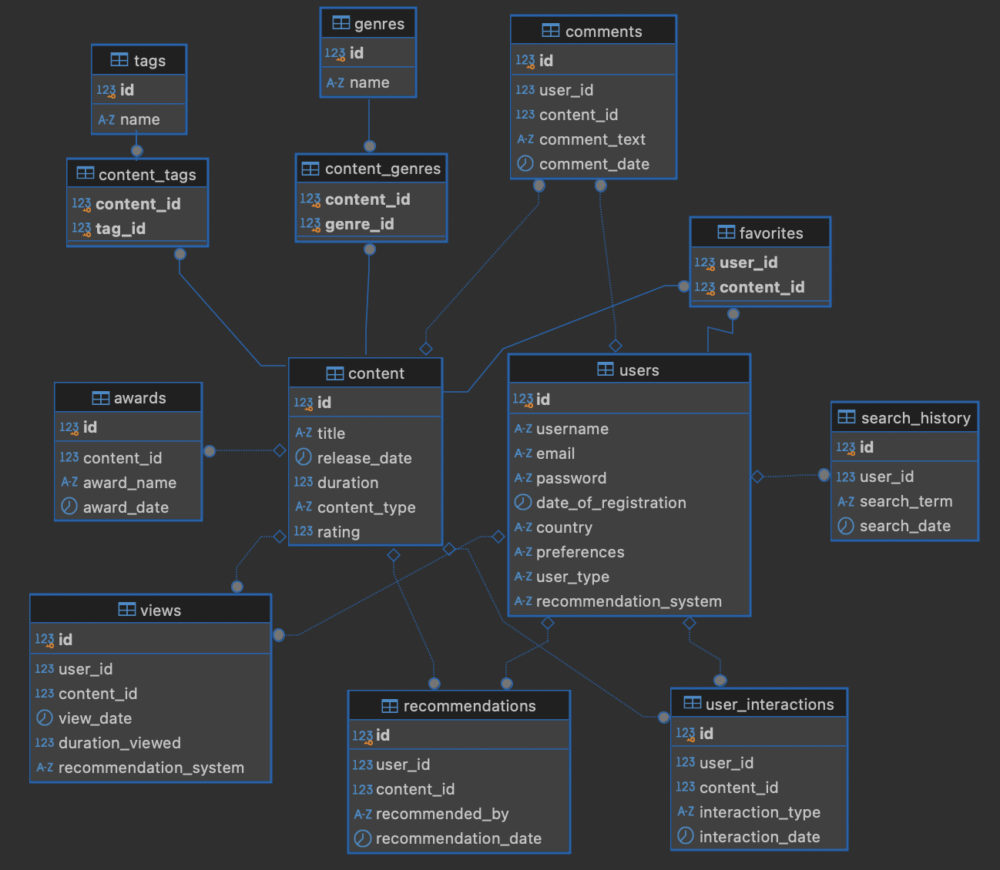

# Proyecto 6: AB Testing Streaming


## Planteamiento: **Nuevo recomendador para plataforma de streaming**

- Este proyecto forma parte de un bootcamp de formación en Data Science e Inteligencia Artificial.

- Nos ha contratado una popular plataforma de streaming que ofrece una amplia variedad de contenido, desde series y películas hasta documentales y programas en vivo. Esta plataforma cuenta con millones de usuarios alrededor del mundo, cada uno con distintos gustos y preferencias. Para maximizar la satisfacción del usuario y el tiempo que pasan en la plataforma, han implementado diversas funcionalidades a lo largo del tiempo, como listas de reproducción, recomendaciones basadas en historial de visualización y colecciones destacadas.

- Ahora han incluido una nueva funcionalidad de recomendaciones personalizadas. La funcionalidad en prueba es una nueva sección, diseñada para mostrar a los usuarios contenido que probablemente les interese en función de sus hábitos de visualización, género preferido, y otros patrones de comportamiento. Este enfoque busca hacer más efectiva la experiencia de usuario, aumentando la probabilidad de que encuentren contenido de su interés rápidamente, lo cual, en teoría, debería incrementar el tiempo de visualización (tiempo de sesión) y el *engagement* general con la plataforma.

- El tiempo de visualización y el *engagement* son métricas clave para la plataforma de streaming. Un mayor tiempo de visualización indica que los usuarios están más satisfechos con el contenido y que es probable que continúen usando la plataforma, renovando sus suscripciones o incluso subiendo de nivel en sus planes. El engagement, que incluye interacciones como los clics en recomendaciones y la frecuencia de sesiones, permite entender qué tan involucrados están los usuarios con la plataforma y si están encontrando contenido atractivo y relevante.


## Objetivos del Proyecto

- Evaluar si la nueva funcionalidad de recomendaciones personalizadas tiene un impacto significativo en el comportamiento de los usuarios, específicamente en términos de tiempo de visualización y *engagement*. Deberás analizar y comparar estas métricas entre el grupo de control (A), que no tiene acceso a la funcionalidad, y el grupo experimental (B), que sí la tiene.

- Calcular y comparar métricas clave entre ambos grupos para analizar el efecto de la nueva funcionalidad. Algunas de las métricas que puedes calcular son el promedio de tiempo por sesión, tasa de clics en recomendaciones, etc. (esto son solo recomendaciones, pero valoraremos positivamente que penséis en nuevas métricas)

- Además, para confirmar que las diferencias observadas no son producto del azar, se llevará a cabo un análisis estadístico de A/B testing. Este paso es crucial para fundamentar una recomendación final sobre la implementación de la funcionalidad.

- Bsándose en los resultados del análisis y del A/B test, concluir si la funcionalidad de recomendaciones personalizadas genera un impacto positivo. Si se observan mejoras significativas en las métricas clave, recomendar que esta funcionalidad se mantenga y se amplíe a todos los usuarios.


## Estructura del repositorio

El proyecto está construido de la siguiente manera:

- **datos/**: Carpeta que contiene archivos `.csv`, `.json` o `.pkl` generados durante la captura y tratamiento de los datos.

- **images/**: Carpeta que contiene archivos de imagen generados durante la ejecución del código o de fuentes externas.

- **notebooks/**: Carpeta que contiene los archivos `.ipynb` utilizados en la captura y tratamiento de los datos. Están numerados para su ejecución secuencial.
  - `1_QueriesVisualizaciónAnálisis`

- **sql/**: Carpeta que contiene los archivos `.sql` para la creación e inserción de la base de datos datos en DBeaver.

- **src/**: Carpeta que contiene los archivos `.py`, con las funciones y variables utilizadas en los distintos notebooks.
  - `soporte_funciones.py`
  - `soporte_variables.py`

- `.gitignore`: Archivo que contiene los archivos y extensiones que no se subirán a nuestro repositorio, como los archivos .env, que contienen contraseñas.


## Lenguaje, librerías y temporalidad
- El proyecto fué elaborado con Python 3.9 y múltiples librerías de soporte:

    - *Librerías para el tratamiento de datos*
        - [Pandas](https://pandas.pydata.org/docs/)
        - [Numpy](https://numpy.org/doc/)

    - *Librerías para gestión de tiempos*
        - [Time](https://docs.python.org/3/library/time.html)
        - [tqdm](https://numpy.org/doc/)

    - *Librerías para graficar*
        - [Plotly](https://plotly.com/python/)
        - [Seaborn](https://seaborn.pydata.org)
        - [Matplotlib](https://matplotlib.org/stable/index.html)

    - *Librería para gestionar tokens y contraseñas*
        - [DotEnv](https://pypi.org/project/python-dotenv/)

    - *Librería para controlar parámetros del sistema*
        - [Sys](https://docs.python.org/3/library/sys.html)

    - *Librería para conexión a bases de datos SQL*
        - [psycopg2](https://www.psycopg.org/docs/)

    - *Librería para la gestión de avisos*
        - [warnings](https://docs.python.org/3/library/warnings.html)

- El proyecto es funcional al 10 de Noviembre de 2024.

## Instalación

1. Descarga DBeaver, crea una nueva conexión con postgres y ejecuta los scripts que encontrarás en la carpeta `sql`, con los que se creará la base de datos que servirá de base para las consultas. Puedes consultar la documentación de DBeaver [aquí](https://dbeaver.com/docs/dbeaver/).

2. Clona el repositorio
   ```sh
   git clone https://github.com/davfranco1/Proyecto6-AB-Testing-Streaming.git
   ```
3. Instala las librerías que aparecen en el apartado anterior. Utiliza en tu notebook de Jupyter:
   ```sh
   pip install nombre_librería
   ```
4. Genera un archivo para almacenar tus tokens y contraseñas, en este caso para la base de datos de DBeaver:
   Entra en la carpeta `src` y crea `.env`, que contenga el siguiente script, sin olvidar las comillas:
   ```js
   dbeaver_pw = 'contraseña_de_tu_base_de_datos'
   dbeaver_user = 'usuario_de_tu_base_de_datos'
   ```

5. Cambia la URL del repositorio remoto para evitar cambios al original.
   ```sh
   git remote set-url origin usuario_github/nombre_repositorio
   git remote -v # Confirma los cambios
   ```

6. Ejecuta el código en los notebooks.


## Estructura de la base de datos



- Este gráfico muestra el diseño de una base de datos relacional con 13 tablas.

- Un diseño es eficiente y bien estructurado cuando está normalizado, es escalable y facilita la gestión y consulta de los datos almacenados.


## Conclusiones y Próximos Pasos

- El notebook [QueriesVisualizaciónAnálisis](datos/notebooks/1_QueriesVisualizaciónAnálisis.ipynb), contiene explicaciones de los datos y las visualizaciones generadas durante el proyecto.


## Autor

David Franco - [LinkedIn](https://linkedin.com/in/franco-david)

Enlace del proyecto: [https://github.com/davfranco1/Proyecto6-AB-Testing-Streaming](https://github.com/davfranco1/Proyecto6-AB-Testing-Streaming)
